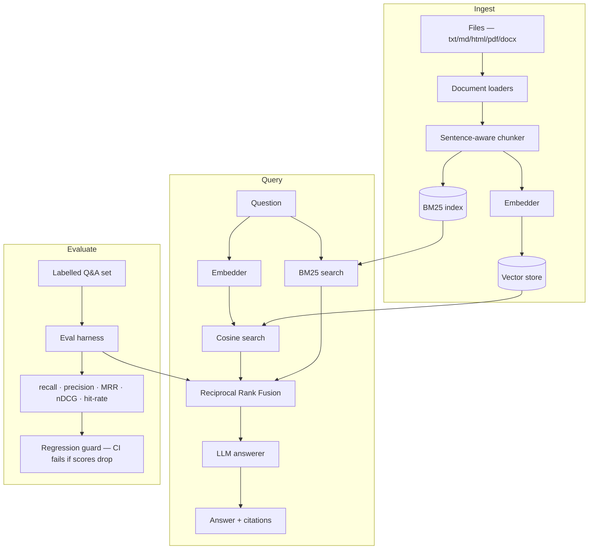

# 🔦 Lumen RAG

> A small, **transparent, and *evaluated*** Retrieval-Augmented Generation engine. Ingest documents, retrieve with vector search, answer with citations — and **measure retrieval quality** with a proper IR metric suite.

[](https://github.com/WickTech/lumen-rag/actions/workflows/ci.yml)


Most RAG demos stop at "it answered my question." Lumen treats retrieval as the
engineering problem it actually is: it ships an **evaluation harness** so you can
prove that recall@5 went *up* when you change your chunking, embeddings, or
reranking — instead of vibes.

> 🔌 **Runs 100% offline.** With no API key, Lumen uses a deterministic hashing
> embedder and an extractive answerer, so the full pipeline — including the eval
> suite — runs in CI with zero secrets. Add `OPENAI_API_KEY` for real embeddings
> and generated answers.

---

## ✅ Current Status

| | |
|---|---|
| **Tests** | 41/41 passing — chunker, vector store, BM25, RRF, loaders, IR metrics, end-to-end |
| **CI** | GitHub Actions: lint (ruff) → pytest → eval regression guard on every push |
| **Python** | 3.10 and 3.12 tested |
| **Offline** | Full pipeline runs with zero API keys or network access |
| **Deployment** | `Dockerfile` ready; FastAPI server on port 8000; [hosted demo on HF Spaces](https://huggingface.co/spaces/WickTech/lumen-rag) |

---

## 🎮 Live demo

**[Try it hosted on Hugging Face Spaces →](https://huggingface.co/spaces/WickTech/lumen-rag)**

Upload your own `.txt`/`.md`/`.html`/`.pdf`/`.docx` files (or load the bundled
sample corpus), ask questions against them, and watch retrieval quality
(recall@k, MRR, nDCG@k) render live from the eval harness — no signup, no API
key, runs entirely on the offline hashing embedder.

Run it locally instead:

```bash
lumen serve && open http://localhost:8000
```

---

## ✨ Features

- **Sentence-aware chunking** with configurable size + overlap.
- **Exact cosine vector search** in a tiny, persistable store (swap for pgvector/Qdrant without touching callers).
- **BM25 + Reciprocal Rank Fusion** — true sparse/dense hybrid retrieval; choose `vector`, `bm25`, or `hybrid` mode per query.
- **Cited answers** — every response carries numbered source citations.
- **Streaming answers** — Server-Sent Events on `POST /query/stream`.
- **Multi-format ingestion** — `.txt`, `.md`, `.html`/`.htm` (no extra deps), `.pdf` (`pip install lumen-rag[pdf]`), `.docx` (`pip install lumen-rag[docx]`).
- **Interactive demo UI** — upload docs, ask questions, and watch eval metrics render live at `/` (served by the FastAPI app, no separate frontend build).
- **📊 Evaluation harness** — recall@k, precision@k, MRR, nDCG@k, hit-rate over a labelled question set.
- **Eval regression guard** — `scripts/check_eval.py` enforces minimum score thresholds in CI; the build fails if retrieval quality drops.
- **Three interfaces** — Python API, Typer CLI, and a FastAPI server.

---

## 🏗️ Architecture



```
lumen_rag/
├── ingestion/
│   ├── loaders.py   txt / md / html / pdf / docx → {"id","text","metadata"}
│   ├── chunker.py   sentence-aware chunking with overlap
│   └── pipeline.py  docs → chunks → embeddings → vector store
├── store.py         persistable cosine vector store (.lumen_index/)
├── retrieval/
│   ├── bm25.py      BM25Index + reciprocal_rank_fusion()
│   └── retriever.py Retriever(mode=vector|bm25|hybrid)
├── embeddings.py    HashingEmbedder (offline) + OpenAIEmbedder
├── llm.py           grounded answerer with citations; offline extractive fallback
├── eval/            ⭐ IR metrics + evaluation harness
├── api/             FastAPI — /ingest /ingest/upload /query /query/stream /eval /health /stats
│   └── static/      interactive demo UI, served at /
├── cli.py           lumen ingest | ask | eval | serve
└── scripts/
    └── check_eval.py  eval regression guard (enforces score thresholds)
```

---

## 🚀 Quick start

```bash
git clone https://github.com/WickTech/lumen-rag && cd lumen-rag
pip install -e ".[dev]"            # add ,openai for real embeddings

# Index the sample corpus and ask a question (works offline)
lumen ingest data/docs                                 # picks up .txt, .md, .html, .pdf, .docx
lumen ask "How many approvals does a billing change need?"
lumen ask "When do we deploy?" --mode bm25             # vector | bm25 | hybrid

# Measure retrieval quality and enforce score thresholds
python scripts/check_eval.py data/eval.jsonl --k 3 --mode hybrid
```

Example eval output:

```
  Retrieval eval — 19 cases @ k=3
  ----------------------------------
  recall@k       0.9737
  precision@k    0.3333
  mrr            0.9737
  ndcg@k         0.9677
  hit_rate       1.0000
```

### As a server

```bash
lumen serve            # or: docker build -t lumen . && docker run -p 8000:8000 lumen
curl localhost:8000/health
curl -X POST localhost:8000/ingest -H 'content-type: application/json' \
  -d '{"documents":[{"id":"d1","text":"We deploy at 4pm on weekdays."}]}'
curl -X POST localhost:8000/query  -H 'content-type: application/json' \
  -d '{"question":"When do we deploy?","k":3,"mode":"hybrid"}'
```

Interactive docs at `http://localhost:8000/docs`.

### As a library

```python
from lumen_rag.engine import RagEngine

engine = RagEngine()
engine.add_documents([{"id": "policy", "text": "Engineers get 20 vacation days."}])
print(engine.query("How much vacation do I get?").text)
```

---

## 🧪 Testing

```bash
pytest -q                                                   # 41 tests, all offline
ruff check .                                                # lint
python scripts/check_eval.py data/eval.jsonl --k 3          # eval regression guard
```

CI runs on Python 3.10 & 3.12: lint → pytest → `check_eval.py` (enforces recall@k ≥ 0.80, hit\_rate ≥ 0.80, mrr ≥ 0.70). The build fails if scores drop.

---

## 📊 Benchmarks — what chunking and hybrid retrieval actually buy you

Measured with `scripts/benchmark.py` on the bundled 7-document / 19-question
reference corpus (`data/docs` + `data/eval.jsonl`), offline hashing embedder,
k=5. Reproduce with `python scripts/benchmark.py`.

| Configuration | recall@5 | precision@5 | MRR | nDCG@5 | hit rate |
|---|---|---|---|---|---|
| naive (1 chunk/doc, vector-only) | 0.97 | 0.20 | 0.93 | 0.94 | 1.00 |
| + sentence chunking (vector-only) | 0.97 | 0.20 | **0.97** | **0.97** | 1.00 |
| + hybrid (BM25 + RRF) | 0.97 | 0.20 | **0.97** | **0.97** | 1.00 |

Recall and hit-rate are already saturated on this reference corpus (the right
document almost always makes the top 5), so the honest signal is in
**ranking quality**: sentence-aware chunking lifts MRR and nDCG@5 from 0.93 →
0.97 by fixing a real failure mode — a long, multi-topic document's
whole-document embedding gets diluted by unrelated sections, so the correct
doc sometimes ranks 2nd or 3rd instead of 1st. Chunking isolates the
answer-bearing passage so it wins on its own merits.

Hybrid ties chunked-vector here because the offline hashing embedder is
itself a bag-of-words signal, close in kind to BM25 — the two rankers agree.
Hybrid's real edge (catching exact rare-term/numeric matches a semantic
embedding under-weights) shows up more with `OPENAI_API_KEY` set and on
noisier, larger corpora; see [`docs/case-study.md`](docs/case-study.md) for
the full writeup and methodology.

---

## 🗺️ Roadmap

- [x] **BM25 hybrid search** — sparse + dense fusion via Reciprocal Rank Fusion; `vector | bm25 | hybrid` mode per query
- [x] **PDF / DOCX / HTML ingestion** — document loaders with clean text extraction
- [x] **Streaming answers** — server-sent events on `POST /query/stream`
- [x] **Eval regression guard** — `scripts/check_eval.py` in CI; build fails if recall drops
- [ ] **pgvector / Qdrant / Pinecone adapters** — swap the in-memory store for a production vector DB without touching engine callers
- [ ] **Cross-encoder reranker** — second-stage reranking with a small cross-encoder model for higher precision
- [ ] **Multi-tenant namespaces** — isolate document collections per user/team with a namespace key
- [ ] **Async FastAPI endpoints** — connection-pooled async DB and embedder calls for concurrency
- [ ] **Fine-tuned embedding adapter** — LoRA adapter trained on domain Q&A pairs to improve recall

---

## 📈 What this demonstrates

- Treating retrieval quality as a **measurable, regression-tested** property.
- Clean ports-and-adapters design: embedder, store, reranker, and answerer are each swappable.
- Pragmatic offline-first engineering so the project is reproducible without secrets.
- Shipping the same core through three surfaces (library / CLI / HTTP).

## 📄 License

MIT — see [LICENSE](./LICENSE).
