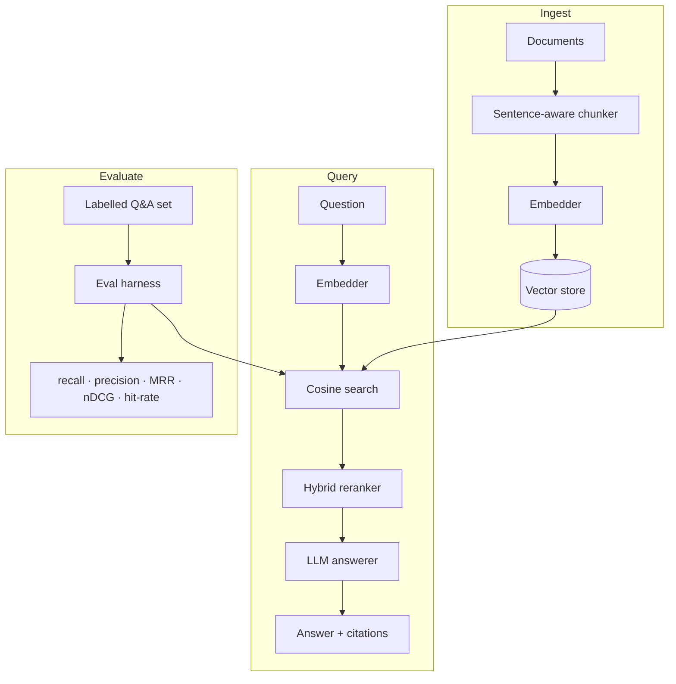

# 🔦 Lumen RAG

> A small, **transparent, and *evaluated*** Retrieval-Augmented Generation engine. Ingest documents, retrieve with vector search, answer with citations — and **measure retrieval quality** with a proper IR metric suite.

[](https://github.com/WickTech/lumen-rag/actions/workflows/ci.yml)


Most RAG demos stop at "it answered my question." Lumen treats retrieval as the
engineering problem it actually is: it ships an **evaluation harness** so you can
prove that recall@5 went *up* when you change your chunking, embeddings, or
reranking — instead of vibes.

> 🔌 **Runs 100% offline.** With no API key, Lumen uses a deterministic hashing
> embedder and an extractive answerer, so the full pipeline — including the eval
> suite — runs in CI with zero secrets. Add `OPENAI_API_KEY` for real embeddings
> and generated answers.

---

## ✅ Current Status

| | |
|---|---|
| **Tests** | 14/14 passing — chunker, vector store, IR metrics, end-to-end |
| **CI** | GitHub Actions: lint (ruff) → pytest → live eval pass on every push |
| **Python** | 3.10 and 3.12 tested |
| **Offline** | Full pipeline runs with zero API keys or network access |
| **Deployment** | `Dockerfile` ready; FastAPI server on port 8000 |

---

## ✨ Features

- **Sentence-aware chunking** with configurable size + overlap.
- **Exact cosine vector search** in a tiny, persistable store (swap for pgvector/Qdrant without touching callers).
- **Hybrid reranking** — blends vector similarity with lexical overlap to fix pure-vector misses.
- **Cited answers** — every response carries numbered source citations.
- **📊 Evaluation harness** — recall@k, precision@k, MRR, nDCG@k, hit-rate over a labelled question set.
- **Three interfaces** — Python API, Typer CLI, and a FastAPI server.

---

## 🏗️ Architecture



```
lumen_rag/
├── ingestion/   chunker + pipeline (docs → chunks → vectors)
├── store.py     persistable cosine vector store
├── retrieval/   query embedding + hybrid reranking
├── llm.py       grounded, citation-enforcing answerer
├── eval/        ⭐ IR metrics + evaluation harness
├── api/         FastAPI app
└── cli.py       `lumen ingest | ask | eval | serve`
```

---

## 🚀 Quick start

```bash
git clone https://github.com/WickTech/lumen-rag && cd lumen-rag
pip install -e ".[dev]"            # add ,openai for real embeddings

# Index the sample corpus and ask a question (works offline)
lumen ingest data/docs
lumen ask "How many approvals does a billing change need?"

# Measure retrieval quality against a labelled set
lumen eval data/eval.jsonl --k 3
```

Example eval output:

```
  Retrieval eval — 5 cases @ k=3
  ----------------------------------
  recall@k       1.0000
  precision@k    0.3333
  mrr            1.0000
  ndcg@k         1.0000
  hit_rate       1.0000
```

### As a server

```bash
lumen serve            # or: docker build -t lumen . && docker run -p 8000:8000 lumen
curl localhost:8000/health
curl -X POST localhost:8000/ingest -H 'content-type: application/json' \
  -d '{"documents":[{"id":"d1","text":"We deploy at 4pm on weekdays."}]}'
curl -X POST localhost:8000/query  -H 'content-type: application/json' \
  -d '{"question":"When do we deploy?","k":3}'
```

Interactive docs at `http://localhost:8000/docs`.

### As a library

```python
from lumen_rag.engine import RagEngine

engine = RagEngine()
engine.add_documents([{"id": "policy", "text": "Engineers get 20 vacation days."}])
print(engine.query("How much vacation do I get?").text)
```

---

## 🧪 Testing

```bash
pytest -q          # unit + end-to-end, all offline
ruff check .       # lint
```

CI runs the suite on Python 3.10 & 3.12 **and** runs a real eval pass on the
sample corpus on every push.

---

## 🗺️ Roadmap

Features planned for future iterations:

- [ ] **pgvector / Qdrant / Pinecone adapters** — swap the in-memory store for a production vector DB without touching engine callers
- [ ] **OpenAI `text-embedding-3-small` integration** — drop-in embedder upgrade with benchmarked recall gain
- [ ] **BM25 hybrid search** — combine sparse keyword scores with dense vectors (Reciprocal Rank Fusion)
- [ ] **Cross-encoder reranker** — second-stage reranking with a small cross-encoder model for higher precision
- [ ] **PDF / DOCX / HTML ingestion** — document loaders that extract clean text before chunking
- [ ] **Streaming answers** — server-sent events on the FastAPI `/query` endpoint
- [ ] **Multi-tenant namespaces** — isolate document collections per user/team with a namespace key
- [ ] **Async FastAPI endpoints** — connection-pooled async DB and embedder calls for concurrency
- [ ] **Regression test suite** — lock eval scores in CI; fail the build if recall@5 drops below threshold
- [ ] **Fine-tuned embedding adapter** — LoRA adapter trained on domain Q&A pairs to improve recall

---

## 📈 What this demonstrates

- Treating retrieval quality as a **measurable, regression-tested** property.
- Clean ports-and-adapters design: embedder, store, reranker, and answerer are each swappable.
- Pragmatic offline-first engineering so the project is reproducible without secrets.
- Shipping the same core through three surfaces (library / CLI / HTTP).

## 📄 License

MIT — see [LICENSE](./LICENSE).
